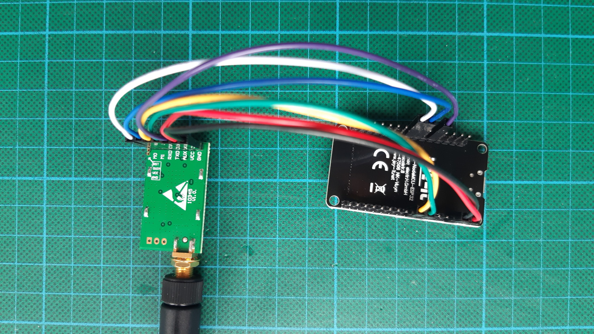

# loraE22
A MicroPython class for the Ebyte E22 Series LoRa modules

The supported EBYTE E22 modules are based on SEMTECH SX1262/SX1286 chipsets and are available for the 
400 MHz (410.125...493.125) and
900 MHz (850.125...930.125) frequency ranges and provide 22 dBm max. TX power.  

A simple UART interface is used to control the device.

**EBYTE Datasheets:** 
[E22-900T22D](https://www.ebyte.com/en/product-view-news.html?id=1117) 
[E22-400T22D](https://www.ebyte.com/en/product-view-news.html?id=922)

The loraE22 class is based on the loraE32 class by effevee:
https://github.com/effevee/loraE32

## Warnings

**Connect proper antenna before transmitting!**

**Before use, check your local regulations for using this frequency range. E.g. in most of Europe, the maximum allowed TX power is below the default value of 22 dBm! There might also be additional restrictions, e.g. restrictions on the duty cycle of your transmissions (that is the fraction of air time to the total time spanned during a period of using the device)!**

## NOTE

1. The E22 and E32 are different in many details - 
   - commands
   - register layout
   - mode control
   - AUX signal timing (in Configuration mode, AUX cannot be used to detect completion of command/response sequence)
2. The E22 or E32 modules do not seem to be suitable for LoRaWAN communication
   (e.g. The Things Network)

## Minimal NodeMCU-ESP32 hardware setup

See code for pin configuration.

## Test code
**Notes:** The loraE22 test code differs from the E32 test code in terms of used UART and AUX pin! Furthermore, loraE22 uses 'normal mode', while loraE32 uses 'wakeup mode' in *sendMessage()*. 

Transmission mode | TX (Addr - Ch) | RX (Addr - Ch) | MSG (Addr - Ch) | Transmitter Code | Receiver Code
:---: | :------: | :------: | :------: | :----: | :----:
|transparent|0x0001 - 0x02|0x0001 - 0x02|0x0001 - 0x02|[testSendE22_Transparent.py](examples/testSendE22_Transparent.py)|[testRecvE22_Transparent.py](examples/testRecvE22_Transparent.py)
|fixed P2P|0x0001 - 0x02|0x0003 - 0x04|0x0003 - 0x04|[testSendE22_P2P.py](examples/testSendE22_P2P.py)|[testRecvE22_P2P.py](examples/testRecvE22_P2P.py)
|fixed broadcast|0x0001 - 0x02|0x0003 - 0x04|0xFFFF - 0x04|[testSendE22_Broadcast.py](examples/testSendE22_Broadcast.py)|[testRecvE22_Broadcast.py](examples/testRecvE22_Broadcast.py)
|fixed monitor|0x0001 - 0x02|0xFFFF - 0x04|0x0003 - 0x04|[testSendE22_Monitor.py](examples/testSendE22_Monitor.py)|[testRecvE22_Monitor.py](examples/testRecvE22_Monitor.py)

## Example: Bi-directional transmission between two nodes

Each node sends a message at a fixed interval containing an LED control 
value according to the state of a push button.

Afterwards it checks for received messages. If a message with LED control
value is available, the LED is switched accordingly.

The transmission mode (address/channel config) for the local node and the
peer node can be set as desired in the arrays *addr* and *chan*.

The code of [node0.py](examples/node0.py) and [node1.py](examples/node1.py) is identical except for the settings of
the variables *me* and *peer*.

Node0 | Node1
:---: | :---: 
[node0.py](examples/node0.py)|[node1.py](examples/node1.py)

## Range test setup

The LoRa transmitter sends a string containing its chip ID and a message sequence number at a fixed interval. 

The LoRa receiver prints/logs _\<timestamp\>,\<latitude\>,\<longitude\>,\<altitude\>,\<rssi\>_ at a pre-defined interval.

The receiver's position and a timestamp are decoded from NMEA messages received via UART from a GPS receiver. For this purpose, [micropyGPS](https://github.com/inmcm/micropyGPS) is used.

If available, incoming LoRa messages are received from the ebyteE22 LoRa transceiver module via another UART.
If the messages expected from the LoRa transmitter could not be received for a certain time, an RSSI value of
-255 dBm is assumed, indicating loss of the LoRa radio link.

The tuple _\<timestamp\>,\<latitude\>,\<longitude\>,\<altitude\>,\<rssi\>_ is printed and optionally written to a log file
only if a valid position is available.

If logging is enabled, a filename in the format *log_\<8_random_hex_digits_\>.csv* is created after power-on or reset.
The log files are written to MicroPython's internal file system. Logging must be stopped explicitly by pressing a key, otherwise the 
file cannot be closed properly and will be corrupt/empty.

Two LEDs indicate the state of the GPS fix and the LoRa link, respectively.

Transmitter Node | Receiver Node
:---: | :---: 
[lora_tx.py](range_test/lora_tx.py)|[lora_rssi_logger.py](range_test/lora_rssi_logger.py)

Log files can be converted from CSV-format to a suitable format - such as GPX or KML - on the host later.
See [rssi_csv_to_kml.py](range_test/rssi_csv_to_kml.py) - The KML output file provides the RSSI value as extended data to be
displayed with the elevation plot in GoogleEarth. (Usage: `rssi_csv_to_kml.py log_deadbeef.csv >log_deadbeef.kml`)

Note: The plot just serves as an example - the logging interval should have been shorter and the logging strategy has been modified afterwards.
